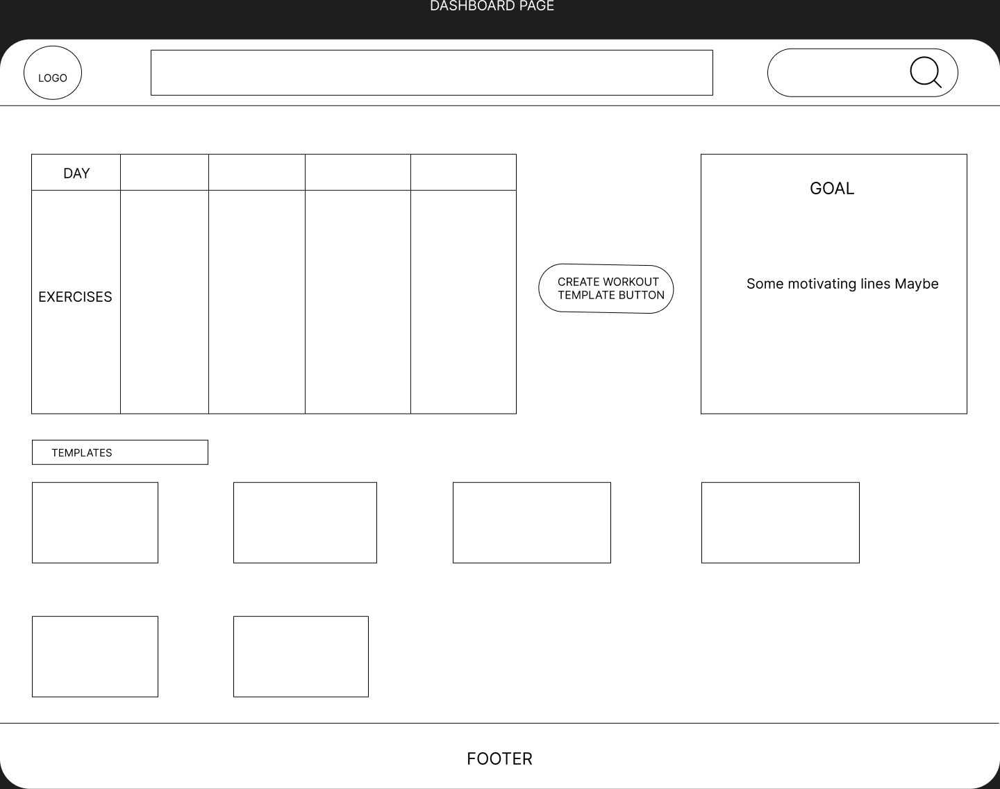
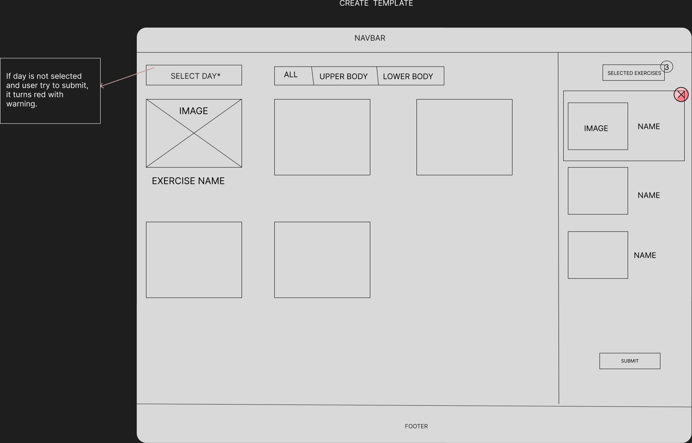
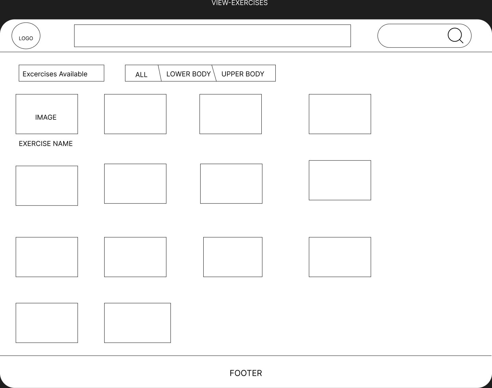
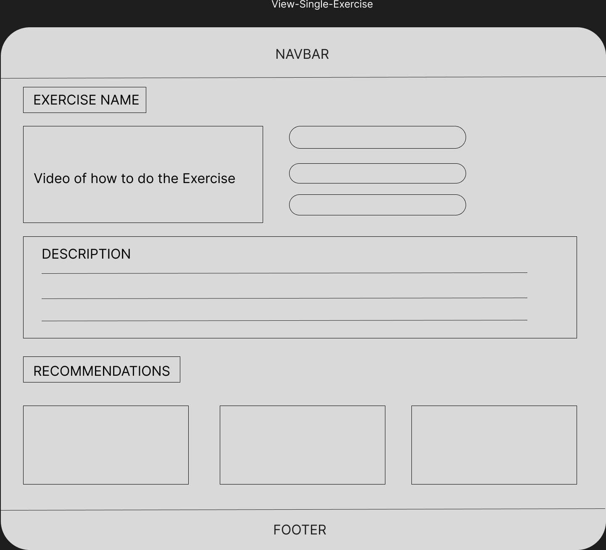
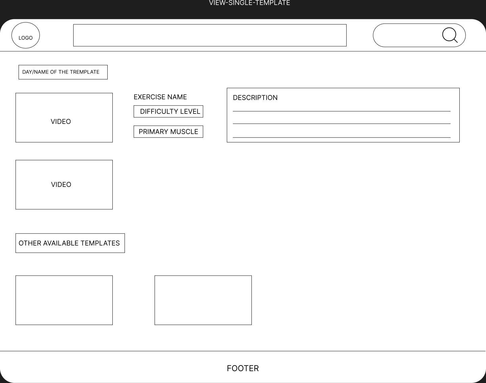
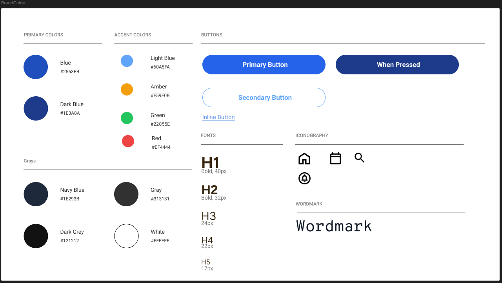

* App Name: SoloFit

* Vision: Make the gym feel welcome for everyone, starting with the very first workout.

* Mission: Help beginners build simple daily workout plans, learn each exercise's target muscles and technique, and train safely by flagging when they're overworking a muscle group.

* Your core user: Beginners

Search 
* What: The user searches for specific body parts and workouts, beginner-friendly exercise recommendations.
* When: Anytime they want to learn more about a workout or add it to their plan.
* Why: Beginners often don't know exercise names, what muscle it works, or the proper technique.
* Where: Top right of the page on the right side of the navigation bar.
* How: By typing a workout name or terms (muscle names) into the search bar (e.g., "Legs", "Shoulders", "Chest").

View All
* What: The user can browse the complete library of exercises.
* When: Anytime they would like to see every possible workout for information.
* Why: Gives beginners a clear view of all available options without forcing them to guess.
* Where: On the Exercise Library Screen.
* How: By tapping the "Library" icon on the bottom navigation bar.

Create
* What: The user builds their weekly workout template per day.
* When: At the start of any day.
* Why: To not have to guess on workouts and use a template during workouts.
* Where: Inside of the "Create Your Workout" tab.
* How: Click the create your workout button and procedure to add workouts.

Edit
* What: Workout plans that have been created.
* When: When daily plans change or when workouts are not what the user wanted.
* Why: Gives the user with full control of their workout plan.
* Where: In the view individual workout plan tab when you click your plan.
* How: By tapping the edit plan button in the dashboard. 

Dashboard / Homepage
* What: Includes create a workout plan button, view weekly workout plan schedule, edit buttons for each workout plan.
* When: First thing upon opening the app.
* Why: To show all the workout plans and give the user customizeability from the homepage
* Where: On the Main Landing Screen (the default tab when opening the app).
* How: By opening the app or tapping the "Home" bar on the navigation bar and scrolling through the homepage.

User Flow:

Wireframe:

### Dashboard

### Create-Template

### View-All-Exercises

### View-single-Exercise

### View-single-Template

Brand Guide:

